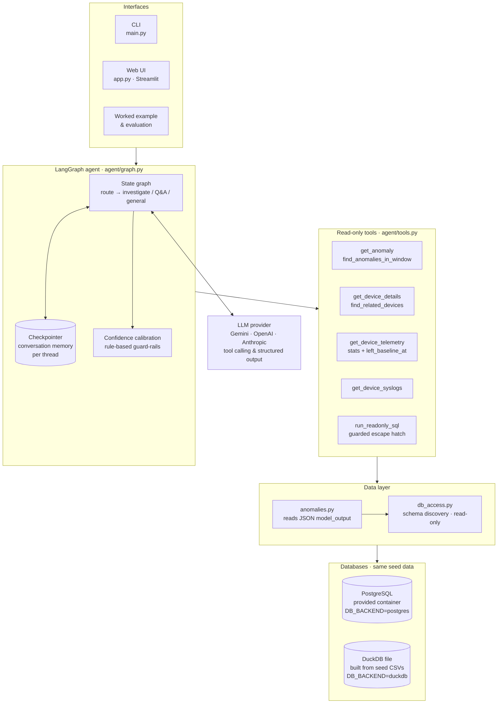
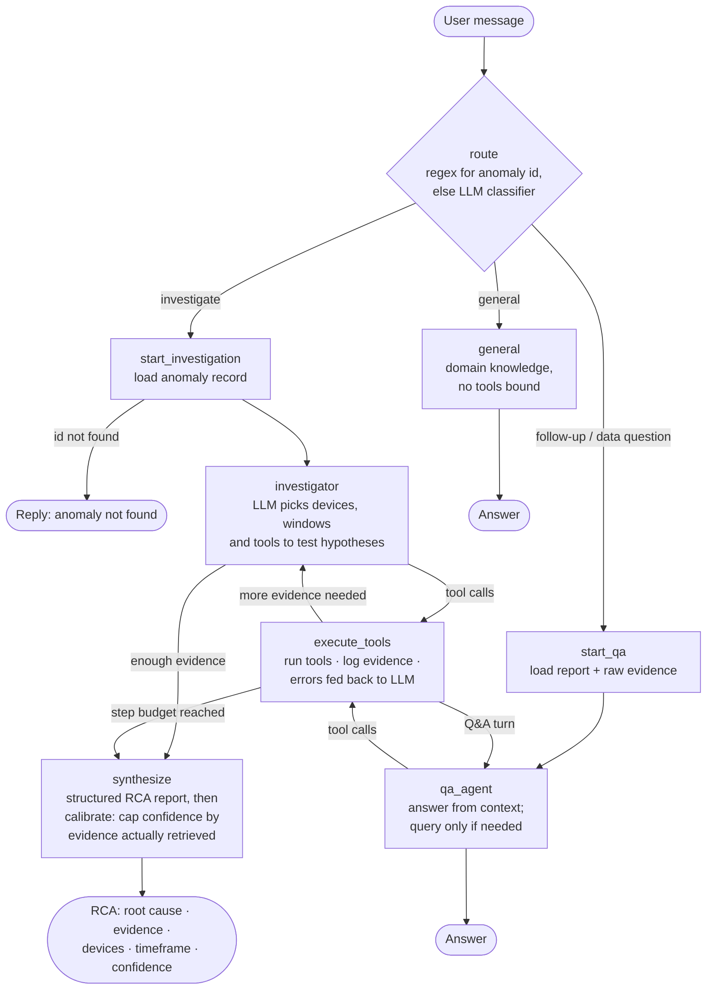

# Network Investigation Agent - Write-up

A LangGraph agent that performs root cause analysis (RCA) on detected network anomalies,
then stays available for conversational follow-ups and general networking questions.

## 1. Running it (VS Code)

The agent runs against either database backend, chosen by `DB_BACKEND` in `.env`:
Developed and run locally on DuckDB built from the provided seed CSVs (no Podman/Docker on my machine); the code defaults to the provided PostgreSQL (DB_BACKEND=postgres), and the Postgres path was verified to return identical tool results on the same data.

### Common setup
1. Open the `starter_code/` folder in VS Code.
2. Create a virtual environment and install dependencies:
   ```bash
   python -m venv .venv
   source .venv/bin/activate          # Windows: .venv\Scripts\activate
   pip install -r requirements.txt
   ```
   Select the interpreter: *Ctrl+Shift+P -> Python: Select Interpreter -> .venv*.
3. `cp .env.example .env` (Windows: `copy .env.example .env`) and set `GOOGLE_API_KEY`
   (or switch `LLM_PROVIDER` and set that provider's key).

### Option A - local DuckDB, no container
4. Build the database file once (`DB_BACKEND=duckdb` is already set in `.env.example`):
   ```bash
   python -m scripts.build_duckdb --from-csv ../db/init     # the challenge's seed CSVs
   ```
   The script finds each table's CSV under that folder and reads column types from the
   `CREATE TABLE` statements in the `.sql` files there, so types match Postgres exactly
   (CSV type-guessing alone would, for example, turn a version string `17.10` into the number `17.1`).
   The seed files are only read, never modified. Alternatives:
   `--from-postgres` copies the running container once (then you can work offline);
   `--demo` builds a small **synthetic** dataset for smoke tests (not the challenge data).
5. Run the commands below.

### Option B - the provided Postgres container
4. `podman-compose up -d` (or `docker compose up -d`). In `.env` set `DB_BACKEND=postgres` and the
   Postgres user/password/port from `podman-compose.yml` (Postgres must be published on `localhost`).
   Inside the Jupyter container, set `PGHOST` to the compose service name instead.
5. Run the commands below.

### Commands (terminal, or the Run and Debug panel - see `.vscode/launch.json`)
```bash
streamlit run app.py                                               # web UI (opens in your browser)
python main.py --investigate a1f0c8e2-1b44-4d90-9c31-000000000001   # RCA, then chat
python -m examples.worked_example                                  # deliverable 3
python -m eval.run_eval --limit 10                                 # optional evaluation
python -m pytest                                                   # tests: no container or API key needed
```
Before submitting, run the worked example once with `DB_BACKEND=postgres` so the output comes from the
provided environment.

### Web UI
`streamlit run app.py` opens a local chat interface on the same graph, memory and `.env` settings:
pick an anomaly in the sidebar (filterable by detector) and press **Investigate**, watch each agent
step live (routing, every tool call and whether it returned data), read the RCA with a colour-coded
confidence badge and an evidence-trail table, then ask follow-ups in the chat box or use the
suggested questions. Every answer has a "How I got this" expander with its steps. Setup problems
(missing API key, database not found) and LLM rate limits are shown as messages, not crashes.

## 2. Architecture and why

```
### System overview



### Agent decision flow (one user turn)


## 3. Tools (all read-only, `agent/tools.py`)

| Tool | Purpose |
|---|---|
| `describe_schema` | Columns, types and example rows for the 4 tables. |
| `get_anomaly` | One anomaly record. |
| `get_device_details` | Inventory row; accepts device id, hostname or IP. |
| `get_device_telemetry` | Device + time window (+ optional metric filter). Returns per-metric/interface stats (min/max/mean, time of peak) plus a sample, rather than thousands of rows. |
| `get_device_syslogs` | Device + window (+ keyword). Counts by severity/facility/mnemonic plus messages. |
| `find_related_devices` | Devices sharing a site or upstream/peer - is the problem local or shared? |
| `find_anomalies_in_window` | Other anomalies in the window - correlation / cascades. |
| `run_readonly_sql` | Guarded escape hatch for aggregates: single SELECT only, keyword blocklist, executed in a `READ ONLY` transaction with a 10s timeout and a 200-row cap. |

The same tools run on Postgres and DuckDB: `agent/db_access.py` translates `%s` placeholders, keeps
both read-only (Postgres `READ ONLY` transactions; DuckDB `read_only=True` connections), and the SQL
guard additionally blocks DuckDB file and network functions (`read_csv`, `glob`, `ATTACH`, `INSTALL`...).
Results sort deterministically (time, then every other column), so both backends return identical
tool output - verified on the same data.

Anomaly records are read through `agent/anomalies.py`, which finds the detector, device(s) and time
window whether they are ordinary columns or packed in a JSON column (the challenge data stores them in
`model_output`), so the LLM, `find_anomalies_in_window`, the UI and the evaluation all see the same
normalised summary. Telemetry statistics include `left_baseline_at` for each metric - when it first
departed from its level at the start of the window - which lets the agent order events and separate the
first domino from its symptoms.

Column names are discovered from `information_schema` at runtime (time column, device column,
hostname <-> id translation), so the tools are generic and not tied to one anomaly or one layout.

## 4. Conversational memory

- LangGraph **checkpointer** (`MemorySaver`) keyed by `thread_id`; each CLI session / notebook
  `InvestigationAgent` is a thread. Swap in `SqliteSaver`/`PostgresSaver` for persistence across restarts.
- State separates **`messages`** (the user-facing conversation) from **`scratch`** (per-turn tool
  chatter, reset each turn by a custom reducer). History stays small and readable.
- The last **`investigation`** (structured report), the **`anomaly`** record and the **`evidence_log`**
  (truncated raw tool outputs) persist in state, so follow-ups like *"what happened first?"* are
  answered from real evidence without repeating the anomaly id. A new anomaly id starts a new
  investigation in the same thread.
- Only the last `HISTORY_WINDOW` messages are sent back to the LLM.

## 5. Testing and evaluation

- `tests/` (offline, no container or API key, 34 tests): SQL guard, calibration rules, the DDL type
  mapping, every tool against a real DuckDB file, the web UI (headless Streamlit AppTest), and graph control flow with a scripted fake LLM - investigation -> follow-up uses memory, general questions use no tools,
  unknown ids short-circuit, zero evidence -> `insufficient`, structured-output fallback.
- `eval/run_eval.py` runs the agent over N anomalies and reports completion, whether named devices
  exist in inventory, whether the anomaly's own device was identified, evidence-source counts,
  confidence distribution, latency and routing accuracy. If the anomaly table has a label-like column
  it is printed alongside for comparison.

## 6. Known limitations

- Confidence calibration is rule-based; it guards against over-confidence but does not verify that
  each cited observation is literally present in tool output (a next step would be an evidence
  verifier node that string-matches values/timestamps).
- Topology inference uses shared site/upstream-style columns; true L2/L3 adjacency (LLDP, peer
  interfaces) is only as good as what `network_devices` contains.
- Telemetry is summarised per series; subtle patterns (e.g. periodicity) can be missed unless the
  LLM re-queries a narrower window. `left_baseline_at` compares against the first quarter of the
  requested window, so the window must start before the incident, and noisy metrics can occasionally
  be flagged.
- `MemorySaver` is in-process; conversations are lost on restart.
- Router mistakes are possible on ambiguous messages; the regex fast path covers explicit ids.
- The regex fast path recognises UUID anomaly ids; other id formats rely on the LLM router.
- DuckDB has no per-query timeout, so the 10-second limit applies only on Postgres.
- `--from-csv` assumes each CSV has a header row; columns with no `CREATE TABLE` type fall back to
  DuckDB's type detection (the build prints which ones).
- No remediation by design - recommendations only.
